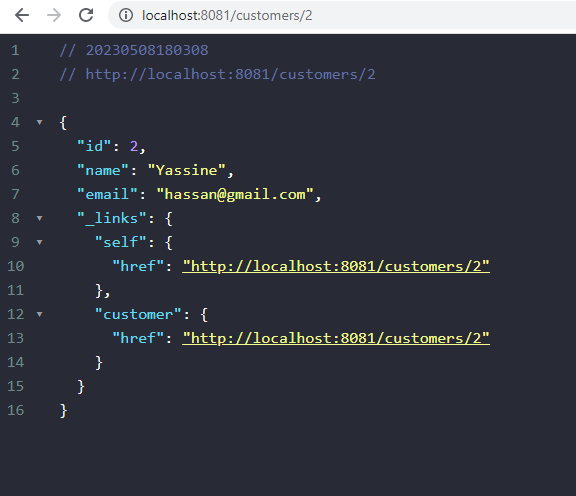

# Building Microservices with Spring Cloud and Netflix Eureka Server
### In this repository:
* Customer-service microservice
* Inventory-service microservice
* Gateway service using Spring Cloud Gateway
* Registry Service directory based on Netflix Eureka Server
* Billing-Service using Open Feign to communicate with the Customer-service and Inventory-service microservices
* Creating an Angular client to display bills

## 1. Customer-service microservice 
<table>
<tr>
        <td width="100%">
          <h3 align="center">Create a new Spring project :</h3>
          <p align="center">
             
          </p>
        </td>
</tr>
</table>
<table>
<tr>
          <h3 align="center">Testing the microservice:</h3>
<td width="50%">
          <p align="center">
             
            </p>
 </td>
 <td width="50%">
          <p align="center">
             
            </p>
 </td>
</tr>
</table>
<table>
<tr>
        <td width="100%">
          <h3 align="center">Checking H2 database :</h3>
          <p align="center">
             
          </p>
        </td>
</tr>
</table>
<table>

## **2. Inventory-service microservice**
<table>
<tr>
        <td width="100%">
          <h3 align="center">Create a new Spring project :</h3>
          <p align="center">
             
          </p>
        </td>
</tr>
</table>
<table>
<tr>
          <h3 align="center">Testing the microservice:</h3>
<td width="50%">
          <p align="center">
             
            </p>
 </td>
 <td width="50%">
          <p align="center">
             
            </p>
 </td>
</tr>
</table>
<table>

## **3. Gateway service using Spring Cloud Gateway**

## 3-1. Static routes configuration : application.yml / application.properties
> `application.properties`
```java
spring.application.name=gateway-service
spring.cloud.discovery.enabled=true
server.port=8888
```
> `application.yml`
```java
spring:
  cloud:
    gateway:
      routes:
        - id : r1
          uri : http://localhost:8081/
          predicates :
            - Path= /customers/**
        - id : r2
          uri : http://localhost:8082/
          predicates :
            - Path= /products/**
```
<table>
<tr>
          <h3 align="center">Getting customers and products via the Gateway-service:</h3>
<td width="50%">
          <p align="center">
             
            </p>
 </td>
 <td width="50%">
          <p align="center">
             
            </p>
 </td>
</tr>
</table>


## 3-2. Static routes configuration : Java Config Class

```java
    @Bean
    RouteLocator routeLocator(RouteLocatorBuilder builder){
        return builder.routes()
                .route("r1", (r) -> r.path("/customers/**").uri("http://localhost:8081/"))
                .route("r2", (r) -> r.path("/products/**").uri("http://localhost:8082/"))
                .build();
    }
```
<table>
<tr>
          <h3 align="center">Getting customers and products via the Gateway-service:</h3>
<td width="50%">
          <p align="center">
             
            </p>
 </td>
 <td width="50%">
          <p align="center">
             
            </p>
 </td>
</tr>
</table>

## **4. Registry Service directory based on Netflix Eureka Server**
<h4>The registry service is a service allowing the registration and discovery of services in a distributed system. In our case, we will create a registry service based on NetFlix Eureka Server.</h4>
<table>
<tr>
<td width="100%">
          <h3 align="center">Instances currently registered with Eureka</h3>
          <p align="center">
             
            </p>
        </td>
</tr>
</table>

## **5. Billing-Service using Open Feign to communicate with the Customer-service and Inventory-service microservices**
<table>
<tr>
        <td width="100%">
          <h3 align="center">Accessing the microservice:</h3>
          <p align="center">
             
          </p>
        </td>
</tr>
</table>
<table>
<tr>
          <h3 align="center">Checking H2 database : :</h3>
<td width="50%">
          <p align="center">
             
            </p>
 </td>
 <td width="50%">
          <p align="center">
             
            </p>
 </td>
</tr>
</table>

## 6. Creating an Angular client to display bills
<h4><a href="https://github.com/Hanif-Ayoub/Angular_Client">link to angular client repository</a></h4>
          <p align="center">
             
            </p>

